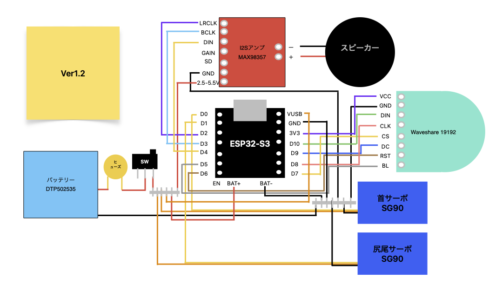

# 🔌 iRobapp-mini ピンアサイン・配線表

本プロジェクト（iRobapp-mini）の電気回路およびメインマイコン「XIAO ESP32-S3」におけるピン割り当ての全レイアウトです。実機のハンダ付けやファームウェア開発時のピン定義のマスターデータとして使用します。
## 📊 回路結線図（グラフィカル配線図）

---

## 1. 🟥 ⬛ 電源・給電ライン（バッテリー・メインスイッチまわり）
※システムの安定動作のため、すべてのデバイスのマイナス（GND）は最終的に1箇所にまとめて共通（コモングランド）に結束します。
※サーボモーター（SG90）は動いた瞬間に大きな電流を消費するため、マイコンのピンからではなく、バッテリー（3.7V〜4.2V）からダイレクトに電源を供給する「直結ルート」を採用しています。

| 送り元（ソース） | 受け手（ディスティネーション） | ワイヤー色 | 役割・備考 |
| :--- | :--- | :---: | :--- |
| **LiPoバッテリー (＋)** | ヒューズホルダーの一端 | 🟥 赤 | リチウムイオン電池の発火・過電流リスクからの保護 |
| **ヒューズホルダーの他端** | 電源スイッチの真ん中 | 🟥 赤 | 安全装置（ヒューズ）を通過した安全な電気 |
| **電源スイッチのON** | **【VCC分岐ハブ】**へ | 🟥 赤 | ロボット全体のメイン電源供給ON/OFFライン |
| **【VCC分岐ハブ】** | XIAOマイコン の **`BAT+`** ピン | 🟥 赤 | バッテリー給電時のマイコン用電源 |
| **【VCC分岐ハブ】** | 首振りサーボ（Pan）の **電源線** | 🟥 赤 | 左右駆動用（電池直結の3.7V〜4.2Vで駆動） |
| **【VCC分岐ハブ】** | 尻尾サーボ（Tail）の **電源線** | 🟥 赤 | 尻尾フリフリ駆動用（電池直結） |
| **LiPoバッテリー (－)** | **`GND共通1F`** / 全デバイスの **GND線** | ⬛ 黒 | **【GND共通ハブ】**にてすべてのマイナス線を1点に結束 |

---

## 2. 📺 丸型液晶（WAVESHARE 1.28inch LCD Module (19192)）SPI通信ライン
※液晶モジュール自体の電源（VCC/GND）は、内部の信号レベル（ロジック電圧）と同期させるため、XIAOマイコン側の `3.3V` および `GND` ピンから給電します。

| XIAOマイコンのピン | 丸型液晶（19192）のピン | ワイヤー色 | 信号の種類（役割） |
| :--- | :--- | :---: | :--- |
| **`３V3` (3.3V)** | **`VCC`** | 🟪 紫 |  |
| **`D10` (GPI10)** | **`DIN`**  | 🟩緑 | |
| **`D8` (GPI8)** | **`CLK`**  | 🟧橙 | |
| **`D7` (GPIO7)** | **`CS`** (Chip Select) | 🟨 黄 | 液晶デバイスを有効化/選択するための信号 |
| **`D9` (GPIO9)** | **`DC`** (Data/Command) | 🟦 青 | 送信データが「画像データ」か「制御コマンド」かの識別信号 |
| **`D6` (GPIO43)** | **`RST`** (Reset) | 🟫 茶 | 液晶モジュールのハードウェアリセット信号 |
| **`D5` (GPIO06)** | **`BL`**  | 🩶 灰 | |
|  | **`GND`** | ⬛ 黒 | **【GND共通ハブ】**にてすべてのマイナス線を1点に結束 |

---

## ⚙️ 3. 駆動系：サーボモーター（SG90）頭部左右制御ライン
※マイコンからのパルス幅変調（PWM）信号を使って、首の角度を正確にコントロールします。

| XIAOマイコンのピン | 接続先（ターゲットサーボ） | ワイヤー色 | 信号の種類（役割） |
| :--- | :--- | :---: | :--- |
| **`D0` (GPIO1)** | **信号線** | 🟨 黄 | 頭部を左右にきょろきょろ動かすための角度制御信号 |
|  | **電源線** | 🟧 橙 | **【VCC分岐ハブ】**より |
|  | **`GND`** | 🟫 茶 | **【GND共通ハブ】**にてすべてのマイナス線を1点に結束 |

---

## ⚙️ 4. 駆動系：サーボモーター（SG90）尻尾左右制御ライン
※マイコンからのパルス幅変調（PWM）信号を使って、尻尾の角度を正確にコントロールします。

| XIAOマイコンのピン | 接続先（ターゲットサーボ） | ワイヤー色 | 信号の種類（役割） |
| :--- | :--- | :---: | :--- |
| **`D1` (GPIO2)** | **信号線** | 🟨 黄 | お尻の尻尾をフリフリ動かすための角度制御信号 |
|  | **電源線** | 🟧 橙 | **【VCC分岐ハブ】**より |
|  | **`GND`** | 🟫 茶 | **【GND共通ハブ】**にてすべてのマイナス線を1点に結束 |

---

## 🔊 5. 音響系：I2Sデジタルオーディオ（MAX98357 ➔ スピーカー）
※XIAOマイコンからデジタル信号（I2S規格）のまま音声データをアンプへ送り、MAX98357チップの内部でアナログへ変換＆ドカンと大音量に増幅してスピーカーを鳴らします。

| XIAOマイコンのピン | アンプ（MAX98357）のピン | ワイヤー色 | 信号の種類（役割） |
| :--- | :--- | :---: | :--- |
| **`VUSB`（５V)** | **`2.5−5.5V`** | 🟥 赤 | 音声増幅アンプ駆動用メイン電源 |
| **`D7` (GPIO7)** | **`LRC`** (WS) | 🟢 緑 | 左右の音声チャンネル（L/R）を識別するワードセレクト信号 |
| **`D9` (GPIO9)** | **`BCLK`** (BCK) | 🫛 薄緑 | ビットクロック信号（データを読み込むタイミング用） |
| **`D6` (GPIO43？)** | **`DIN`** (DATA) | 🟫 茶 | デジタル音声データ（オーディオ波形データそのもの） |
| -- | アンプの **`L+` / `L-`** ➔ **スピーカー端子** | 🛠️ 任意 | 増幅完了後のアナログ音声信号（直接スピーカーへ接続） |

